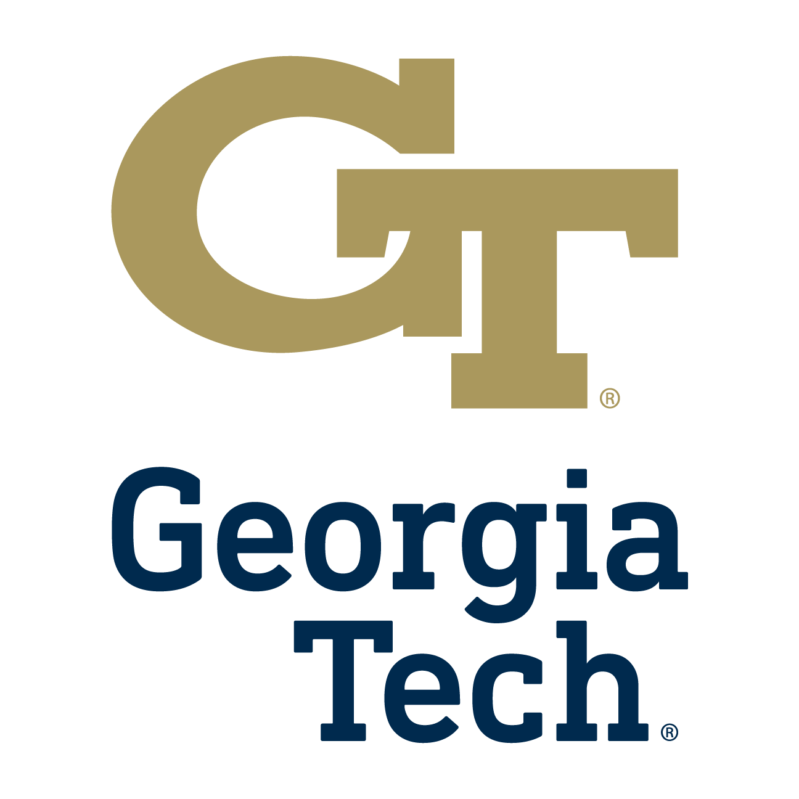

Tutorial Information
========

.. role:: underline
    :class: underline

.. _schedule:

Tutorial Schedule
------------

| Orlando, Florida
| Date/Time: Sunday May 5th, 12:30 pm - 3:00 pm, EST
| Youtube Live Stream link: `TOBEUPDATED <https://www.fccm.org/>`_

"Understanding your FPGA design better" Tutorial
     | Part 1: Simulated performance (LightningSim)
     | **>> Part 2: Measured performance (RealProbe)**

RealProbe Tutorial Schedule: 1:40 pm — 3:00 pm
     | 1:40 pm – 1:50 pm : Introduction to the RealProbe tool
     | 1:50 pm – 2:40 pm : Hands-on experiments using RealProbe
     | 2:40 pm – 3:00 pm : Discussion and closing

.. _organizers:

Organizers
------------
Sharc Lab at Georgia Tech
     | `Jiho Kim <https://jihoray.github.io/>`_, `Sharc Lab <https://sharclab.ece.gatech.edu/>`_, `Georgia Tech <https://www.gatech.edu/>`_
     | Cong "Callie" Hao, `Sharc Lab <https://sharclab.ece.gatech.edu/>`_, `Georgia Tech <https://www.gatech.edu/>`_

.. image:: ../img/sharc_logo.png
  :alt: Sharc Lab
  :width: 150

