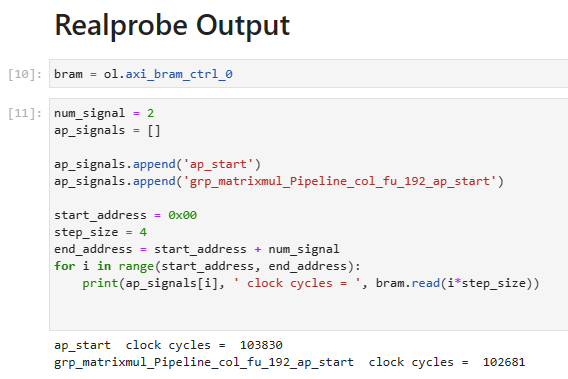
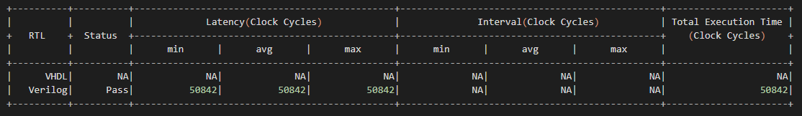

Example 1: Matrix multiplication (Single function)
==============================

In this section, we'll explore the end-to-end workflow of RealProbe with a Vitis HLS project that implements a basic matrix multiplication kernel. This example is from `Kastner et al.'s excellent Parallel Programming for FPGAs github repository <https://github.com/KastnerRG/pp4fpgas/>`_. The tutorial example setup includes HLS source files (matrixmultiplication.cpp), testbench files (matrixmultiplication-top.cpp), and data files (matrixmultiplication.gold.dat), along with a pre-configured hls.tcl script.

Preparing Vitis HLS tcl Script
--------------------

Vitis HLS can be operated through the GUI or via a batch-mode Tcl script. Below is a breakdown of the hls.tcl script structure, crucial for RealProbe as it reads ``solution_name``, ``project_name``, and ``target_device`` for future bitstream generation:

1. Define Variables

.. code-block:: 

  set solution_name solution1
  set project_name project
  set target_device {xc7z020clg400-1}

2. Setup Project

.. code-block:: 

  open_project -reset $project_name
  add_files matrixmultiplication.cpp
  add_files -tb matrixmultiplication-top.cpp
  add_files -tb matrixmultiplication.gold.dat
  set_top matrixmul
  open_solution -reset $solution_name
  set_part $target_device
  create_clock -period 10 -name default

3. Run Simulations and Synthesis

.. code-block:: 

  csim_design -code_analyzer -clean  
  csynth_design
  export_design -format ip_catalog
  cosim_design -trace_level all
  close_project

.. note::

   Ensure that the variable names for ``solution_name``, ``project_name``, and ``target_device`` remain unchanged. The Tcl script name must also be kept as ``hls.tcl``

Run RealProbe
--------------------

To integrate RealProbe and override the default Vitis HLS functions, execute the following command:

.. code-block:: 

  make all

Deploy on FPGA
--------------------

Post RealProbe execution, a directory named ``FPGA`` will be generated within your project directory containing all necessary files for on-board execution. This includes an automatically generated Jupyter Notebook file (excluding software implementation for functional verification but incorporating RealProbe results).

On the Synestia Pynq-Z2 FPGA Jupyter server, navigate to the ``FPGA`` directory in the project folder (accessible via both Synestia desktop and Pynq-Z2 board) and execute the commands in the notebook using ``Shift + Enter``.

RealProbe Output Results
--------------------

When running the RealProbe output section in the notebook, you'll observe the results as shown below:

Compare with Co-sim results
--------------------

RealProbe recorded a total of 103,830 cycles for the operation. To contrast, let's review the Co-simulation results, which do not provide internal cycle counts but do report total latency for the top module. Refer to the report found at ``$project_name/$solution_name/sim/report/$topmodule_name_cosim.rpt``, showing 50,842 clock cycles.

This discrepancy highlights a 104.2% difference between the Co-simulation and actual on-FPGA results, emphasizing the importance of RealProbe in understanding true FPGA performance.

.. note::

   Even though Co-simulation does not provide cycle counts per module, its waveform can be examined for detailed timing analysis. Below is a waveform snapshot from this matrix multiplication example, marked with the start and end of the top function. Using the set 10ns clock cycle, the timing is calculated, resulting in a close approximation to the reported cycle count.
  .. image:: ../img/ex1_waveform.png
  :alt: <RealProbe Output>
