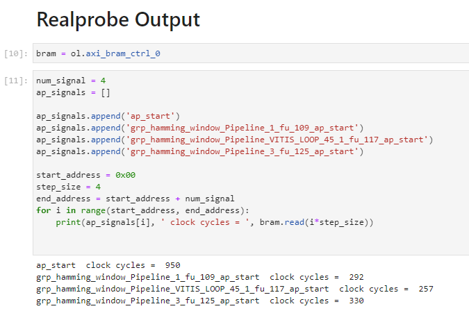
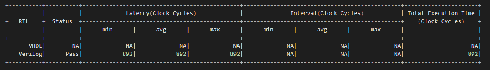

Example 2: Hamming distance (multi-function)
==============================

Continuing from our initial example, we now delve into a more complex scenario involving multiple functions using the Hamming distance kernel, sourced from the `Vitis HLS Introductory Examples github repository <https://github.com/Xilinx/Vitis-HLS-Introductory-Examples/>`_. This tutorial setup includes HLS source files (hamming_window.c, hamming_window.h), and testbench files (hamming_window_test.c), along with a similar hls.tcl script configuration as previously described.

Run RealProbe
--------------------

To integrate RealProbe and override the default Vitis HLS functions, execute the following command:

.. code-block:: 

  make all

Deploy on FPGA
--------------------

After RealProbe has been run, a directory named ``FPGA`` is created in your project directory. This folder contains all files necessary for on-board execution, including an automatically generated Jupyter Notebook which captures the RealProbe results but excludes the software implementation for functional verification.

Navigate to the ``FPGA`` directory on the Synestia Pynq-Z2 FPGA Jupyter server and execute the notebook commands using ``Shift + Enter``.

RealProbe Output Results
--------------------

Upon running the RealProbe output section in the notebook, observe the following performance metrics:

Compare with Co-sim results
--------------------

The operation as captured by RealProbe resulted in a total of 950 cycles. In contrast, the Co-simulation report, accessible at ``$project_name/$solution_name/sim/report/$topmodule_name_cosim.rpt``, records a slightly lower count of 892 cycles.

This discrepancy highlights a -6.5% difference between the Co-simulation and actual on-FPGA results. This example shows RealProbe for accurate performance analysis, especially when dealing with complex multi-function FPGA designs.

