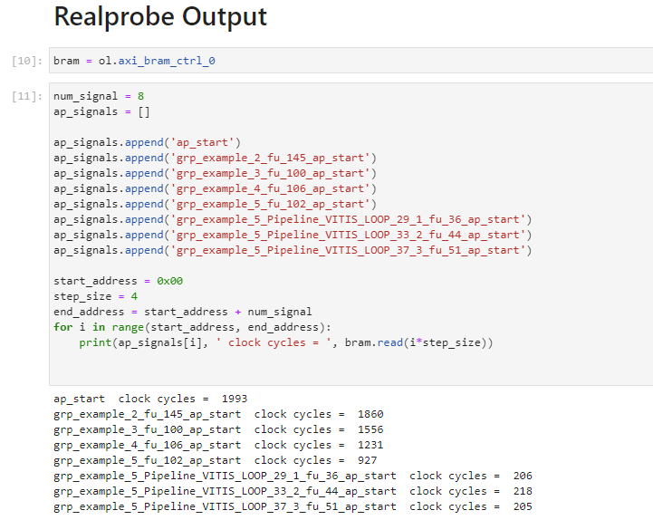
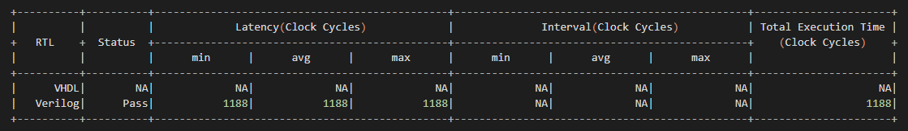

Example 3: Custom function (Nested functions)
==============================

In our final example, we explore a complex scenario involving nested functions within a custom example created for this tutorial. This setup includes HLS source files (example.cpp), which also serve as the testbench, and follows the hls.tcl script configuration detailed in previous examples.

Run RealProbe
--------------------

To integrate RealProbe and override the default Vitis HLS functions, execute the following command:

.. code-block:: 

  make all

Deploy on FPGA
--------------------

After RealProbe has been run, a directory named ``FPGA`` is created in your project directory. This folder contains all files necessary for on-board execution, including an automatically generated Jupyter Notebook which captures the RealProbe results but excludes the software implementation for functional verification.

Navigate to the  ``FPGA`` directory on the Synestia Pynq-Z2 FPGA Jupyter server and execute the notebook commands using ``Shift + Enter``.

RealProbe Output Results
--------------------

After running the RealProbe output section in the notebook, the performance metrics are displayed as follows:

Compare with Co-sim results
--------------------

The total cycle count observed with RealProbe for this example is 1,993 cycles. This contrasts with the Co-simulation results, which show a count of 1,188 cycles, indicating significant differences in timing and execution.

This -67.7% discrepancy between the Co-simulation and the actual on-FPGA results highlights the critical need for accurate on-board measurement, especially in complex designs involving nested functions. 
