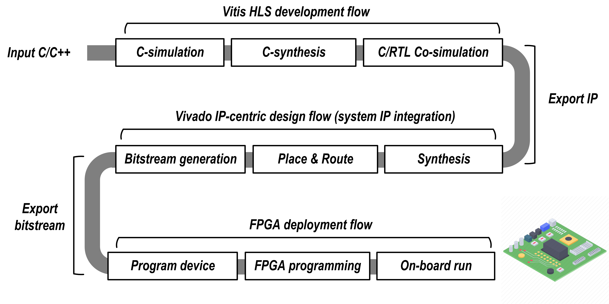

Flow of RealProbe
==============================

RealProbe is a fully-automated, end-to-end on-board profiler designed to streamline FPGA development from high-level synthesis (HLS) to on-board execution.

**What does "end-to-end" imply?** It signifies a seamless, automated process starting from the HLS source code, moving through to bitstream generation, and culminating in on-board execution.

Here’s a look at the traditional FPGA design flow for context:

RealProbe enhances this process by automating the steps between the HLS source code and the on-board execution, significantly simplifying the workflow for users.

Flow of RealProbe
----------------

1. Identify RealProbe pragma
   RealProbe leverages a custom-modified clang/LLVM library to automatically detect #pragma HLS RealProbe insertions in the source code.
2. Modify Vitis HLS IP
   The tool automatically externalizes control signals from the IP generated by Vitis HLS, preparing them for profiling.
3. RealProbe IP generation
   RealProbe generates an realprobe IP module that includes a counter to monitor the number of cycles each operation takes, using the control signals from the Vitis HLS IP.
4. IP integration
   This IP is then seamlessly integrated into the system design. RealProbe automates the compilation and bitstream generation process to facilitate rapid deployment.
5. Results collection function
   Finally, RealProbe automatically creates a Jupyter Notebook (.ipynb file) that users can employ to collect and analyze performance data directly from the FPGA when running the RealProbe profiling tools.

This streamlined flow allows users to focus more on design optimization and less on the intricacies of toolchain management, making FPGA development faster and more efficient.
