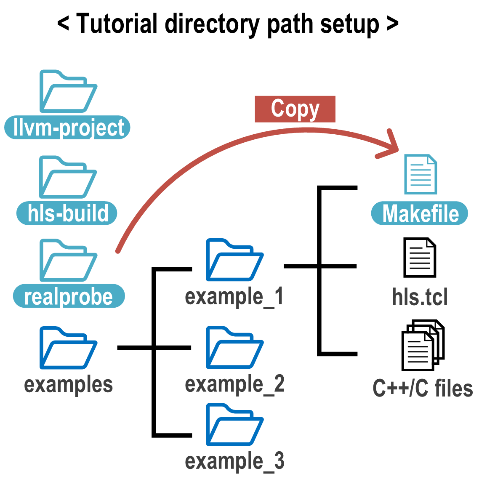

Download RealProbe
==============================

Below is an overview of what the RealProbe GitHub repository directory structure looks like:

Keep this structure in mind as you follow the steps outlined below.

Prerequisites
------------

For this tutorial, you'll need Vitis HLS and Vivado version 2023.1. Please ensure that both tools are installed and updated to this version before proceeding.

.. note::

    RealProbe is tested for Vitis HLS and Vivado version 2023.1. While it may theoretically support other versions if they include an open-sourced llvm build frontend, it is crucial that Vitis HLS, Vivado, and the Vitis HLS LLVM build library are all consistent and use the same version.

Step 1: Download RealProbe
------------

First, clone the RealProbe repository from GitHub. This download should take approximately 2 minutes.

.. code-block:: console

   $ git clone https://github.com/sharc-lab/RealProbe.git
   $ cd RealProbe

Step 2: Set the Download Path
----------------

Next, you'll need to set the path where RealProbe was downloaded. Inside the RealProbe directory, open the Makefile to update the path settings. Ensure that the paths are absolute.

.. code-block:: console

   $ cd realprobe
   $ vi Makefile

In the Makefile, modify the top lines to reflect the absolute path where the RealProbe repository is cloned:

.. code-block:: console

   $ # Change the path to be absolute path
   $ REALPROBE_PATH := <ABSOLUTE PATH>/realprobe
   $ HLS_BUILD_PATH := <ABSOLUTE PATH>/hls-build

Step 3: Navigate to the Project Path
------------

For this tutorial, we will start with the first example. Navigate to the examples folder, select the first example, and copy the Makefile from the RealProbe directory to your project directory to integrate it with your current working environment.

.. code-block:: console

   $ cd ../examples/example_1
   $ cp ../realprobe/Makefile .

This setup will prepare your environment for running RealProbe effectively on your projects.

