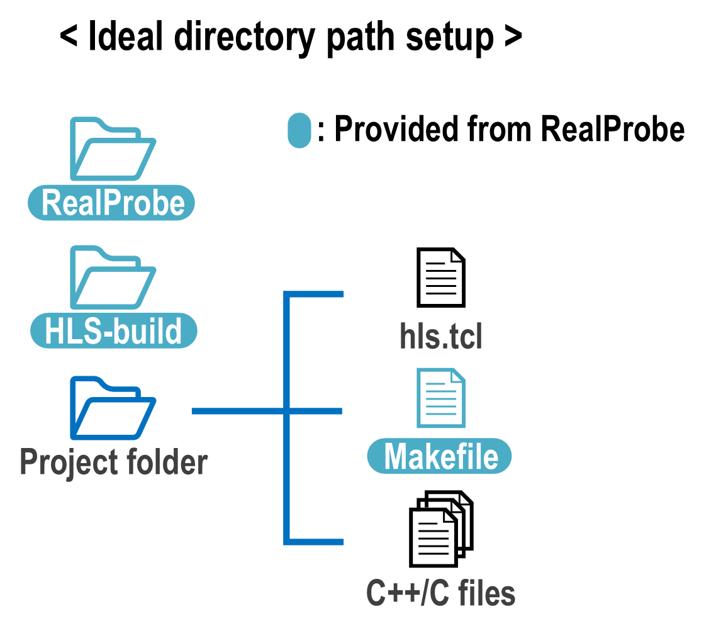

Download RealProbe
==============================

Prerequisites
------------

Before starting, ensure both Vitis HLS and Vivado version is v2023.1. 

Directory Path Setup
------------

Ideally, this will be the ideal directory path setup for running RealProbe

based on this figure in mind, you can follow the below steps.

Step 1: Set Up Your HLS Project
----------------
First, set up your HLS project folder. You have to prepare all C/C++ files to run HLS, also the hls.tcl script that runs Vitis HLS. Our GitHub repository offers many examples (in benchmark folder) so you can refer to tcl script to run Vitis HLS. 

Step 2: Download RealProbe
------------

First download the RealProbe on github.

.. code-block:: console

   $ git clone https://github.com/sharc-lab/RealProbe.git

   $ cd RealProbe
