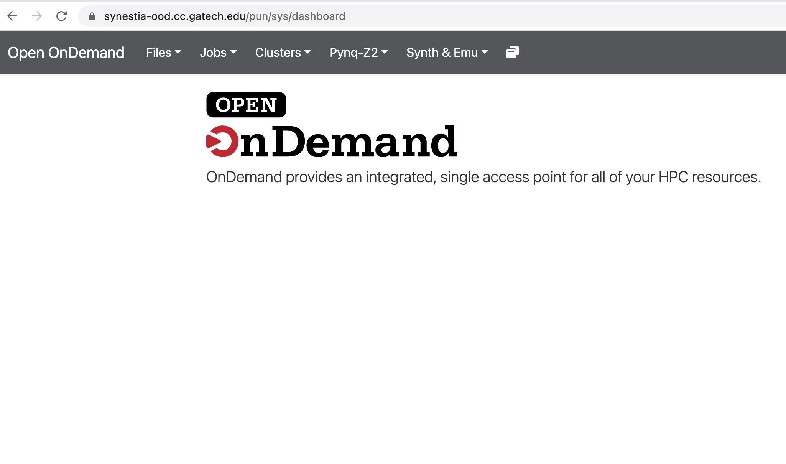
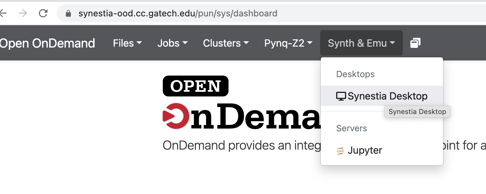
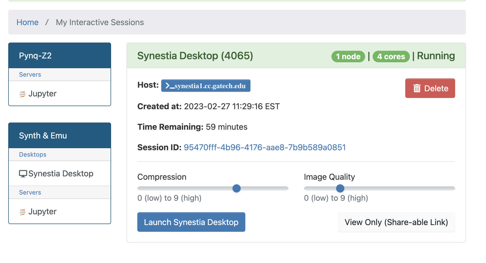
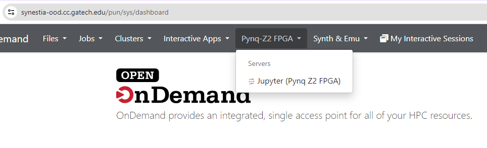
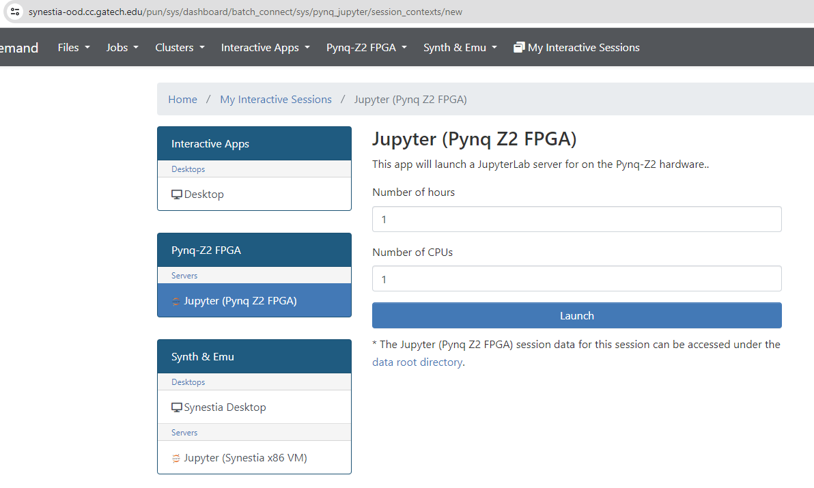
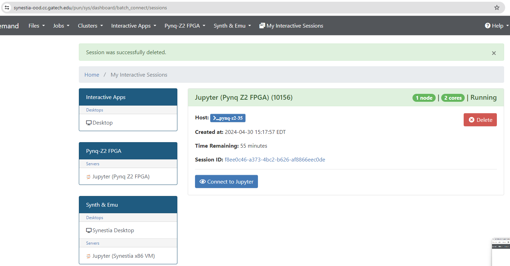
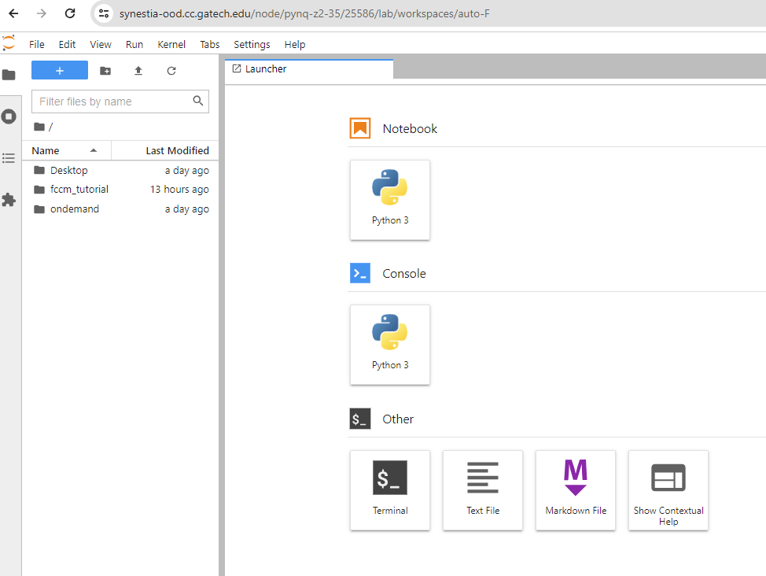

Setup 
==============================

This tutorial system setup has been provided by Dr. Jeff Young from `Center for Research into Novel Compute Hierarchies <https://crnch.gatech.edu/>`_ at Georgia Tech.

We will be using `Synestia Desktop <https://synestia-ood.cc.gatech.edu/pun/sys/dashboard/batch_connect/sys/synestia_desktop/session_contexts/new/>`_ for interacting with tools, and `Synestia Pynq Z2 FPGA <https://synestia-ood.cc.gatech.edu/pun/sys/dashboard/batch_connect/sys/pynq_jupyter/session_contexts/new>`_ for interacting with FPGA boards.

CRNCH System Setup
------------
To open interactive desktop for the tutorial, visit `synestia-ood.cc.gatech.edu/>`_. 

For RealProbe, we will be using the Synestia VMs to run Vitis HLS, Vivado. Under the “Synth & Emu” tab, within the “Desktops” section, click “Synestia Desktop”:

